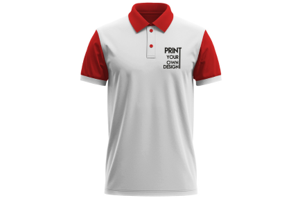
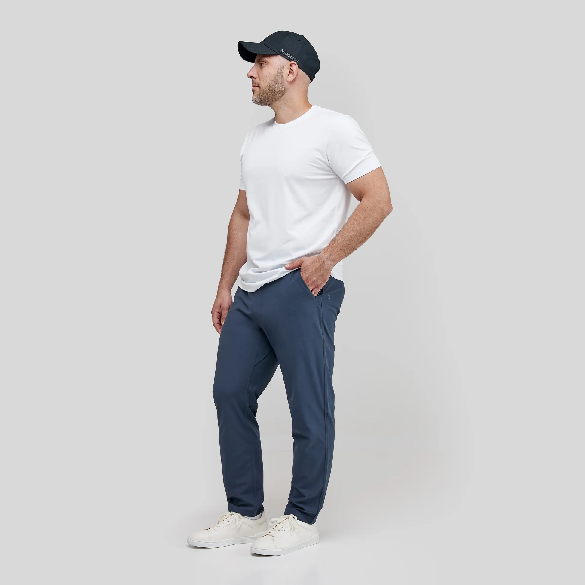
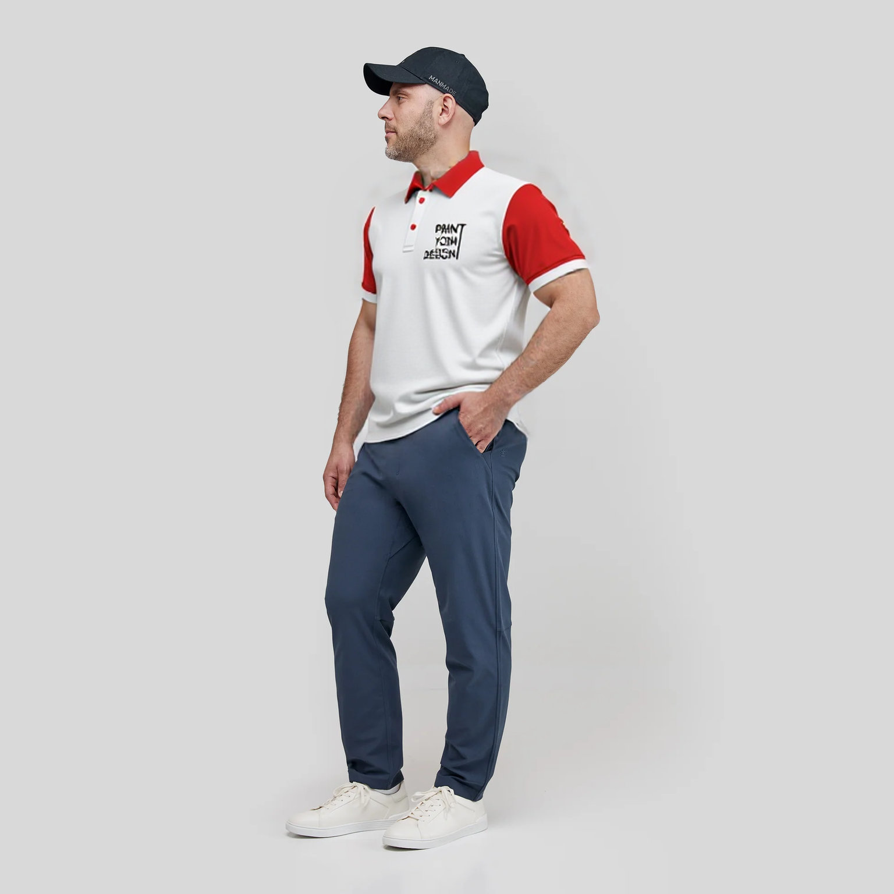

<p float="left">
  
  
  
</p>

&nbsp;

# Key Parameters

- `--model_image`: Path to input model/person image (**required**)
- `--clothes_image`: Path to input clothes/costume image (**required**)
- `--mask_prompt`: Mask prompt for automatic segmentation  
  _(default: `"clothes"`)_
- `--description`: Additional description for better results  
  _(default: `"32K UHD, ultra-high resolution, extremely sharp, intricate details, masterpiece, realistic, Clothes wrinkle naturally"`)_
- `--resolution`: Output resolution (choices: `1344`, `1536`, `1920`, `2048`)  
  _(default: `"1536"`)_
- `--lora_cloth_weight`: LoRA weight for clothes migration (range: `0.0`–`1.0`)  
  _(default: `0.0`)_
- `--lora_subject_weight`: LoRA weight for subject (range: `0.0`–`1.0`)  
  _(default: `1.0`)_
- `--seed`: Seed for generation (`-1` for random)  
  _(default: `-1`)_

---

# Usage Example

```bash
cog predict \
  -i model_image=@path/to/model_image.jpg \
  -i clothes_image=@path/to/clothes_image.jpg \
  -i mask_prompt="t-shirt" \
  -i description="8K UHD, photorealistic, professional photography, detailed fabric texture, natural lighting, high quality" \
  -i resolution="1920" \
  -i lora_cloth_weight=0.8 \
  -i lora_subject_weight=0.9 \
  -i seed=42
  ```
---

# Notes

This workflow uses models that are not supported by default in `cog-comfyui`:

- `Migration_Lora_cloth.safetensors` (stored under `loras`)
- `comfyui_subject_lora16.safetensors` (stored under `loras`)
- `flux1-fill-dev.safetensors` (stored under `diffusion_models`)
- `flux1-redux-dev.safetensors` (stored under `style_models`)
- `ae.safetensors` (stored under `vae`)
- `ViT-L-14-BEST-smooth-GmP-TE-only-HF-format.safetensors` (stored under `clip`)
- `t5xxl_fp16.safetensors` (stored under `clip`)
- `sigclip_vision_patch14_384.safetensors` (stored under `clip_vision`)

