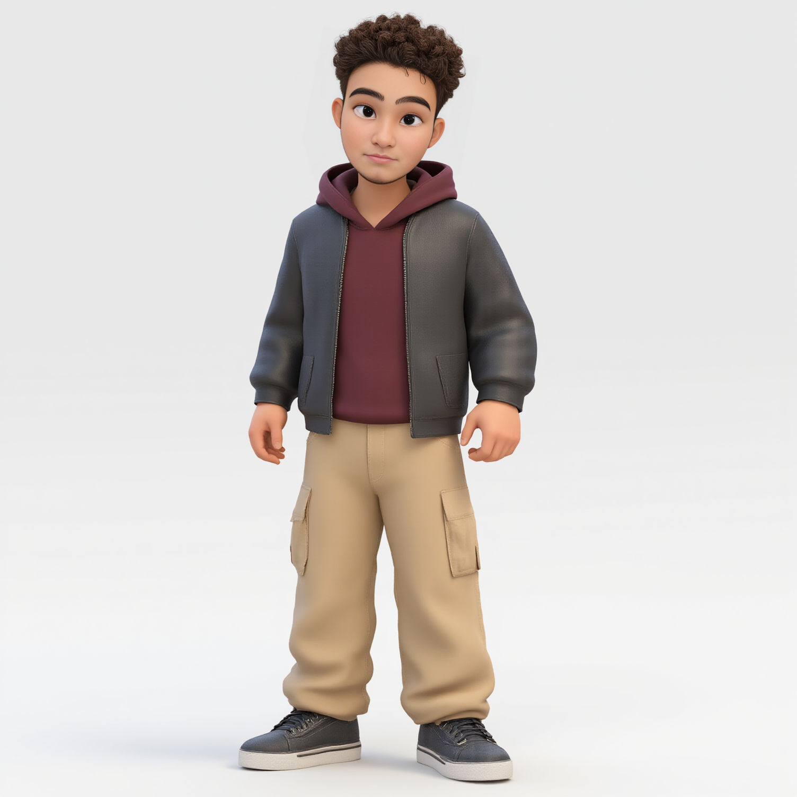
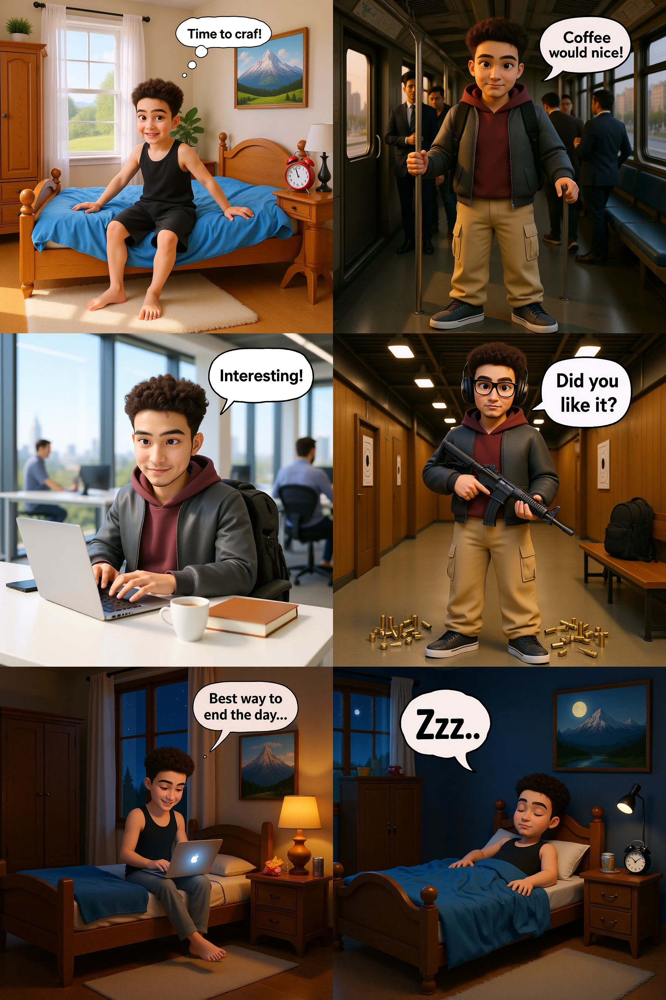

<p float="left">
  
  
</p>

&nbsp;

## Key Parameters

- `--reference_image`: Reference image for character consistency across all panels (**required**)
- `--positive_prompt`: Main character description used as base for all panels  
_(default: `""`)_
- `--negative_prompt`: Elements to avoid in generation  
_(default: `""`)_
- `--panel_1_prompt`: Scene description for Panel 1 (Morning wake-up scene)
_(default: `""`)_
- `--panel_2_prompt`: Scene description for Panel 2 (Subway commute scene)
_(default: `""`)_
- `--panel_3_prompt`: Scene description for Panel 3 (Office work scene)
_(default: `""`)_
- `--panel_4_prompt`: Scene description for Panel 4 (Shooting range scene)
_(default: `""`)_
- `--panel_5_prompt`: Scene description for Panel 5 (Evening relaxation scene)
_(default: `""`)_
- `--panel_6_prompt`: Scene description for Panel 6 (Night sleep scene)
_(default: `""`)_
- `--main_seed`: Seed for main character generation  
_(default: `-1`)_
- `--panel_1_seed`: Seed for Panel 1 generation  
_(default: `-1`)_
- `--panel_2_seed`: Seed for Panel 2 generation  
_(default: `-1`)_
- `--panel_3_seed`: Seed for Panel 3 generation  
_(default: `-1`)_
- `--panel_4_seed`: Seed for Panel 4 generation  
_(default: `-1`)_
- `--panel_5_seed`: Seed for Panel 5 generation  
_(default: `-1`)_
- `--panel_6_seed`: Seed for Panel 6 generation  
_(default: `-1`)_

---

# Usage Example

```bash
cog predict \
-i reference_image=@character_reference.jpg \
-i positive_prompt="He has black cap and blue jacket" \
-i negative_prompt="blurry, low quality, distorted" \
-i panel_1_prompt="Character waking up in modern apartment, stretching in bed" \
-i panel_2_prompt="Character in subway car, holding coffee, commuter crowd" \
-i panel_3_prompt="Character at office desk, typing on laptop, focused expression" \
-i panel_4_prompt="Character at gym, lifting weights, determined expression" \
-i panel_5_prompt="Character at home, cooking dinner, relaxed expression" \
-i panel_6_prompt="Character reading book in bed, peaceful expression" \
-i main_seed=12345 \
-i panel_1_seed=11111 \
-i panel_2_seed=22222 \
-i panel_3_seed=33333 \
-i panel_4_seed=44444 \
-i panel_5_seed=55555 \
-i panel_6_seed=66666
```
---

# Notes 
This workflow can be quite unpredictable once in a while. Trying different seeds to achieve best quality is recommended. Workflow might also generate not accurate text bubles. 