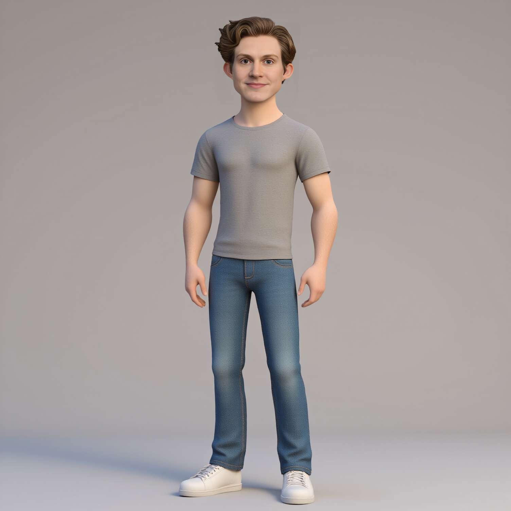

<p float="left">
 
 
</p>
<p float="left">
 
 
</p>

&nbsp;

## Key Parameters

- `--input_image`: Path to face reference image for identity preservation (**required**)
- `--character_description`: Description of the character's appearance, clothing, and pose  
_(default: `"A casually dressed man in his mid-20s. He wears a plain, fitted crewneck t-shirt in soft gray and a pair of straight-cut blue jeans..."`)_
- `--width`: Output image width in pixels  
_(default: `1504`)_
- `--height`: Output image height in pixels  
_(default: `1504`)_
- `--seed`: Seed for reproducible generation  
_(default: `-1` for random)_
- `--face_restore_visibility`: Face restoration visibility (0.0 to 1.0)  
_(default: `1.0`)_
- `--codeformer_weight`: CodeFormer weight for face restoration (0.0 to 1.0)  
_(default: `0.5`)_
- `--detect_gender_source`: Gender detection for face swapping  
_(choices: `"no"`, `"male"`, `"female"`, default: `"male"`)_

---

# Usage Example

```bash
cog predict \
-i input_image=@person_photo.jpg \
-i character_description="A young woman in a red hoodie and black jeans, standing confidently with hands on hips" \
-i width=1024 \
-i height=1024 \
-i seed=42 \
-i face_restore_visibility=0.8 \
-i codeformer_weight=0.6 \
-i detect_gender_source="female"
```

# Notes
This workflow uses models that are not supported by default in `cog-comfyui`:
- `Jixar_flux_v2.safetensors` (stored under `loras`)
- `3DMM_V12.safetensors` (stored under `loras`)
- `Detailed_imperfect_skin_faces_and_torso_for_FLUX-000025.safetensors` (stored under `loras`)