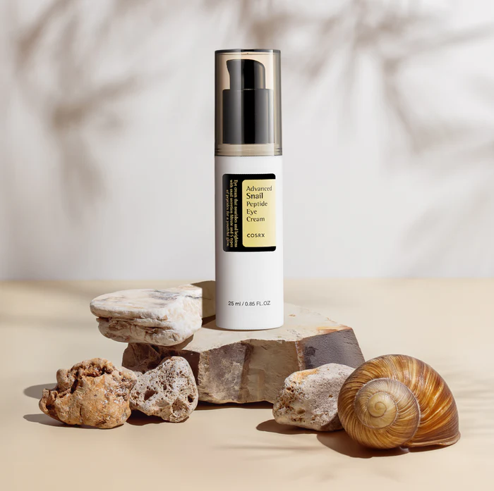
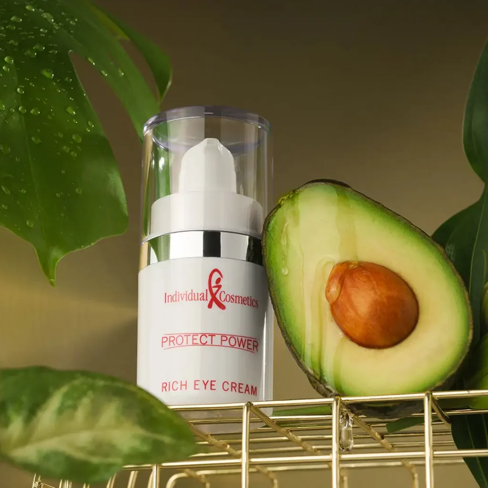
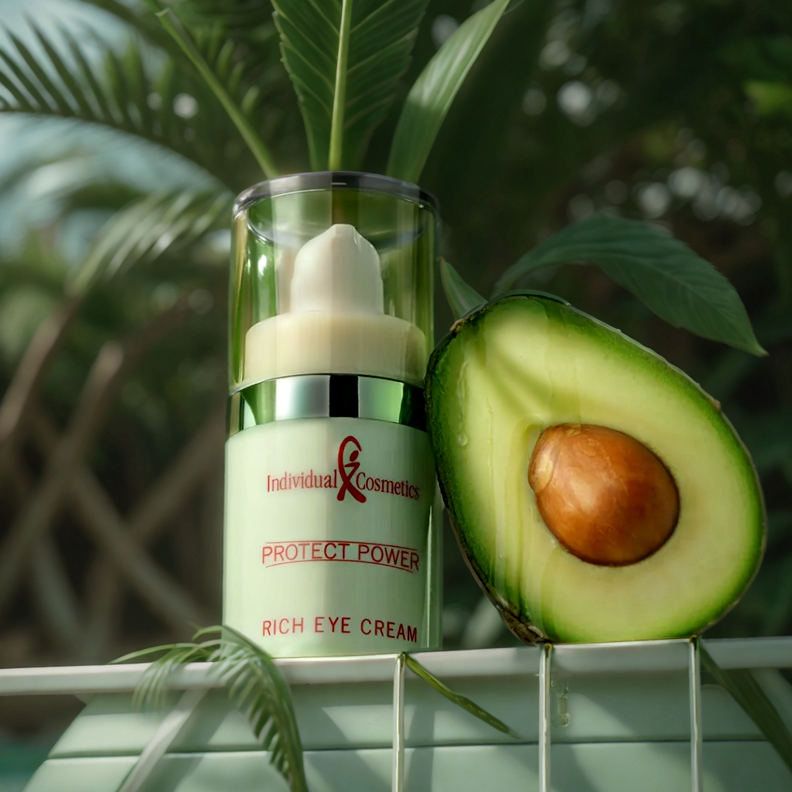

<p float="left">
  
  
</p>

<p float="left">
  
  
</p>

&nbsp;

## Key Parameters

- `--input_image`: Path to product image to change background for (**required**)
- `--positive_prompt`: Description of desired background    
  _(default: `"commercial photo, light green and white, greenery background, depth of field, high level feeling, perfect lighting, OC renderer, Blender, super sharp, super noise reduction"`)_
- `--negative_prompt`: What to avoid in generation    
  _(default: `"(noise, blur, worst quality, low quality, error, cropped, bad anatomy, bad proportions, wrong hands)\n(NSFW, nude)"`)_
- `--width`: Output image width in pixels    
  _(default: `1024`, range: 512-2048)_
- `--height`: Output image height in pixels    
  _(default: `1024`, range: 512-2048)_
- `--seed`: Seed for reproducible generation    
  _(default: `-1` for random)_

---

# Usage Example

```bash
cog predict \
  -i input_image=@product_bottle.png \
  -i positive_prompt="modern minimalist studio, white background, soft lighting, professional photography" \
  -i negative_prompt="cluttered, dark, blurry, low quality" \
  -i width=1024 \
  -i height=1024 \
  -i seed=12345
  ```
---

# Notes
This workflow uses model that are not supported by default in `cog-comfyui`:
- `RMBG-1.4` (stored under `rembg`)
- `iclight_sd15_fc.safetensors` (stored under `diffusion_models`)
